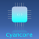

#   Cyancore Framework
###### *A unified platform for embedded system projects ...*
---

### Supported Platforms


| Atmel      | SiFive       | TI           |
| ---------- | ------------ | ------------ |
| ATMega328P | Freedom E310 |  TM4C123GXL  |
| ATMega2560 |

### Projects

* Demo AVR
* Demo ARM
* Demo RISC-V

### Help
run
```
make help
```
