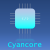

#   Cyancore Framework
###### *A unified software platform for embedded system projects ...*
---

> **Version (arch:2 | major:4 | minor:2): 0.1.0**
```
arch  : 0x00
major : 0x0001
minor : 0x00
```

### Discord Community
[](https://discord.gg/gxUQr77MT2)

Click the above icon to connect

### Supported Platforms

| Atmel      | SiFive      | STMicro     | TI          |
| ---------- | ----------- | ----------- | ----------- |
| ATMega328P | Coming soon | Coming soon | Coming soon |

### Projects
* demo_avr
* demo_avr_cpp
* demo_avr_bit_banding

### Programming Languages
* asm/assembly
* C
* Cpp/C++
* makefile
* linker script

### Help
run
```
make help
```

For details about the framework, follow the README.md in each folder.

### Requirements

Host system requirements:
* Linux Machine (WSL/Dedicated machine)
* make utility installed


Toolchaine Requirements:
* Please push your toolchains to your git repo
* Update the links in mk/tc_get.mk file
* run ```make help``` for more details
